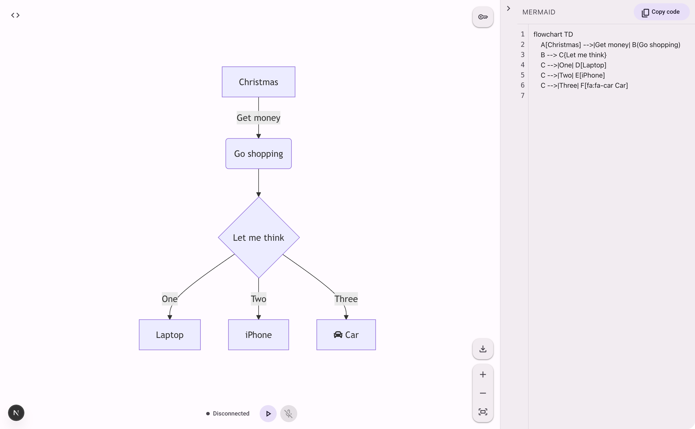

# Saygram

[](LICENSE)


<a href="https://divinoborges.github.io/saygram/"></a>

Build Mermaid diagrams by voice using the OpenAI Realtime API.



Saygram is a Next.js app that connects your microphone to the [OpenAI Realtime API](https://platform.openai.com/docs/guides/realtime) over [WebRTC](https://developers.openai.com/api/docs/guides/realtime-webrtc/) and lets a model author and edit a single Mermaid diagram while you talk. The model uses [function calling](https://developers.openai.com/api/docs/guides/realtime-conversations/) to mutate the diagram in place, the canvas re-renders live, and you can drop into the side panel at any time to edit the Mermaid source by hand.

## What you can do

- **Dictate diagrams in plain language.** Describe what you want, in any language; the assistant replies in the language you used.
- **Pick from any supported Mermaid type.** The model can produce `flowchart`, `sequence`, `class`, `state`, `er`, `gantt`, `mindmap`, `timeline`, `pie`, `journey`, `gitGraph`, `quadrantChart`, `requirement`, `c4`, `sankey`, and `block` diagrams.
- **Two model tools drive every change.**
  - `set_diagram(mermaid_code, diagram_type)` — full replace, used for new diagrams, type switches, or large restructures.
  - `patch_diagram(find, replace)` — targeted edit; `find` must be a unique exact substring of the current code, otherwise the patch fails and the model retries or falls back to `set_diagram`.
- **Edit the source directly.** A collapsible side panel exposes the live Mermaid code; edits are committed back into the same store the model reads from, so the next voice instruction works against your hand edits.
- **Pan and zoom the canvas.** Viewport controls (pan, zoom in/out, reset) sit on the canvas itself.
- **Export the diagram.** PDF, SVG, and PNG export are available from the canvas controls.
- **Local persistence.** Your current diagram, the side panel layout, and your API key (if you supplied one in the UI) are kept in `localStorage` so a refresh doesn't lose state.
- **Material 3 theming.** Tokens are derived from a seed color and follow your OS light/dark preference automatically.

## Getting started

### 1. Set up the OpenAI API

- If you're new to the OpenAI API, [sign up for an account](https://platform.openai.com/signup).
- Follow the [Quickstart](https://platform.openai.com/docs/quickstart) to retrieve your API key.

### 2. Clone the repository

```bash
git clone <repo-url>
cd <repo-name>
```

> Replace `<repo-url>` with the URL shown on the project's GitHub page (top-right "Code" button).

### 3. Provide an OpenAI API key

You have three ways to provide an OpenAI API key. The first one that resolves wins:

1. **Per-visitor key in the UI (browser-only)** — click the key icon in the top-right corner and paste a key. It is stored only in your own browser's `localStorage`. When you start a session, the browser sends it to this app's `/api/session` route as `Authorization: Bearer …`; the server uses it once to mint a short-lived OpenAI Realtime client secret and discards it. The key is never persisted or logged server-side. This path takes precedence over any `.env` value, so a self-host operator who also has `OPENAI_API_KEY` set can still test their own personal key without changing the server config.
2. **Project `.env` file** — create a `.env` at the project root with `OPENAI_API_KEY=<your_api_key>`. Used as a fallback when no browser key is present.
3. **System-wide env var** — set `OPENAI_API_KEY` [globally in your system](https://platform.openai.com/docs/quickstart#create-and-export-an-api-key). Same fallback role as `.env`.

For a public deployment you can leave `OPENAI_API_KEY` unset — visitors will be prompted to provide their own key on first use.

Notes on the browser-key path:

- Storage is `localStorage` on the app's origin, which is plain text and readable by any script running on that origin. Use a [project-scoped key](https://platform.openai.com/api-keys) with a usage cap rather than a personal admin key.
- The key is sent over the network only as `Authorization: Bearer` to this app's `/api/session` route, only at the moment a session starts. If you operate the deployment, verify your host's request-logging redacts auth headers.

### 4. Install dependencies

```bash
npm install
```

### 5. Run the dev server

```bash
npm run dev
```

The app will be available at [http://localhost:3000](http://localhost:3000).

## Using the app

1. **Start a session.** The status bar sits at the bottom-center of the canvas. Click the connect button — the status flips through `connecting` → `listening` once the WebRTC peer connection is established.
2. **Toggle the microphone.** The mic button next to the connect button mutes/unmutes you mid-session. Stopping the session resets the conversation.
3. **Dictate the diagram.** Describe what you want in any language. If your request is ambiguous about which Mermaid type fits best, the assistant will ask before generating.
4. **Iterate by voice.** "Rename node B to Auth Service", "add an arrow from Login to Session Store", "switch this to a sequence diagram" — each becomes a `patch_diagram` or `set_diagram` call and the canvas re-renders.
5. **Edit code directly.** Open the side panel (right edge) to tweak the Mermaid source by hand. Your edits become the new source of truth for the next voice instruction.
6. **Reset.** Say "reset", "clear", "start over", or the equivalent in any language to wipe the diagram.
7. **Export.** Use the export controls to download the current diagram as PDF, SVG, or PNG.

## Customization

Reach for these files when you want to change behavior:

- **Model behavior, voice, and prompt** — `lib/config.ts`. `BASE_INSTRUCTIONS` is the system prompt the model receives, and `VOICE` selects the Realtime voice (defaults to `coral`).
- **Tool surface** — `lib/diagram-tools.ts`. Add, remove, or rename the tools the model can call. The Realtime session loads whatever this file exports.
- **Theming** — `lib/m3-theme.ts` derives the Material 3 token palette from a seed color, and `lib/theme-pref.ts` handles light/dark resolution against the OS preference.

## License

This project is licensed under the MIT License. See the [LICENSE](LICENSE) file for details.
